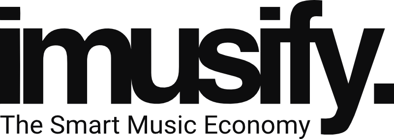

## Values

### Values first.
Values are the constitution of imusify and are uncompromisable. We are an open and value-based economy and crypto-community. This means that we share common values and in order to share these values we develop and distribute products. Violation of the rules may lead to exclusion. 

### The Open Music Economy.
Everybody is welcome to join and contribute if they feel their values match those of imusify. We believe in social equality and fairness. Success and status depend on talent, ability and effort regardless of socioeconomic and financial status. The harder we work, the luckier we get. Open Source, Open Company, Open Community, Open Society. 

### Punctuality, Preparation and Reliability.
We value our time and don't have time to waste. Most important and uncompromisable. It’s not only about being on time, it's about being ahead of schedule and always being prepared. Chance favors the prepared. 

### Speed.
Speed first, perfection follows.

### Open Communication.
We communicate in an open manner via facetime, in public channels or over the phone.

### Entrepreneurship.
Each member leads its own venture and should take self initiative. Think and take action and responsibility cause you are leading your own company. 

### Positivity.
No Ego-Trippin´. We avoid drama, arrogance, sarcasm, cynicism, religion, politics and anything that causes separation and negativity. No attitudes, we are mature, humble and polite.  

### Benevolence. 
Treat others like they would like to be treated. Rather than focusing on our own goals as individuals, as a company or a public project, we aim to serve others. We dedicate ourselves to understanding and fulfilling the needs and dreams of others. We do this by  including our members, contributors, customers, shareholders, fans, and beyond. 

### Inspiration. 
If you find yourself down, seek inspiration to lift yourself back up. Inspiration is contagious. Every single task we do, every single word we express comes from the heart and is of such exceptional enthusiasm that we inspire and ignite the hearts and minds of others. 

### Sustainability.
We create sustainable systems. Each step we make should be documented so followers can simply repeat. Every task should be systemized for the highest value of return. 

### Vision.
Our vision is to improve 50 Million lives. We see ourselves daily having already achieved our goals. We don’t submit to limiting belief systems. Anything is possible. It is just a matter of belief, time, dedication, and a bit of luck.

### Mastermind. 
We are a mastermind of masterminds. We as Individuals rarely make the impossible possible. We do this in an organized effort. We connect brilliant minds and amazing talent to form a global mastermind that is able to change to the world. 

# Links

[Slack](https://join.slack.com/t/imusify/shared_invite/enQtNjk1ODcyMDMxODYzLWQxNDBhNTM2OTg5YjM2ZjRmZDcwMTE0NTVkM2MyMWNhZmM4NmRiNjZkYTE5YWQ5NmI5OWIyMTdhZmY1M2IwMDc)

[Whitepaper](https://docs.google.com/document/d/1v6rkQ1T_sG7Zjpv9dlFPLenMbE7q47Xzj4Qq-xme-jA/edit)

[Contributor Board](https://app.zenhub.com/workspaces/imusify-web-5bb5b97b4b5806bc2beb4b3f/board?repos=147397863)

[Development Board](https://app.zenhub.com/workspaces/imusify-web-5bb5b97b4b5806bc2beb4b3f/board?repos=147397863)

[How to use the imusify app](https://docs.google.com/document/d/1df1x91S2pzJ4LfDaKkhLJaSrUvoxdgVvuILUdtffHQo/edit#heading=h.gjdgxs)

[imusify Github](https://github.com/imusify)

[Medium](https://medium.com/imusify)

[Instagram](https://www.instagram.com/imusify/)

[Twitter](https://twitter.com/imusify)

[Telegram Community](https://t.me/imusifycommunity)

[Telegram Announcements](https://t.me/imusify)

[Facebook Fanpage](https://www.facebook.com/imusify)

[Facebook Group](https://www.facebook.com/groups/344310176008106/)

[LinkedIn](https://www.linkedin.com/company/6461025/admin/)

[YouTube](https://www.youtube.com/user/imusifyyt)

[Zoom](https://zoom.us/j/6382053918?status=success)

[Steemit](https://steemit.com/@imusify)

[Reddit](https://www.reddit.com/r/imusify/)

[BitcoinTalk](https://bitcointalk.org/index.php?topic=4327428.0)

[Blockchain Explorer](https://neotracker.io/)

[Dapps Competition](https://neonewstoday.com/portfolio/imusify/)

[Platform API Documentation](https://imusify-prod.herokuapp.com/)

[Development Guidelines](https://github.com/imusify/imusify-web/wiki/Development-guidelines)

[Terms & Conditions]

# Wallets

[O3](https://www.o3.network/)

[NEON Wallet](https://neonwallet.com/)

# Governance

## Levels:

### Users: 
Anybody that uses our products including Contributors, Members and Core Team. 
### Contributors: 
Anybody that brings value to the ecosystem and aligns with our values.
### Members: 
Contributors that have been elected to be members. Minimum requirements: 12 months regular contribution and proven track record of alignment with our values, demonstrated  consistent self-initiative, 1,000,000 IMU accumulated, elected by members. Fixum negotiable. 
### Core: 
Members who have been elected to join the core team. Minimum requirements: 24 months regular contribution as member, proven track record of alignment with our values, demonstrated consistent managerial and entrepreneurial skills, 5,000,000 IMU accumulated. Elected by Core members. Fixum negotiable.
### Managers: 
Core, Members or Contributors elected by Core Team to manage Core, members and Contributors or a subdivision. Fixum negotiable. 

## Rewards
We reward based on efforts and contribution, not on job titles or what type of work is done.
Rewards will be displayed per individual tasks on the Trello Rewards Board. 
Rewards can be withdrawn if a minimum of 1000 IMU has been reached. 
Reward Spreadsheet

## General Guidelines
Interested people are welcome to join our Zoom Hangouts, Slack and Trello Rewards Board
We use real pictures and real names on Slack, Trello and other tools.
We praise in public and criticize in private. 
Negativity spreads like a wildfire and may result in immediate exclusion. 
Simplicity
Lean Development

## Slack Workflow
General Channel: All general discussions, Github Development and  Trello Rewards Board activties are posted here for everyone to follow and comment. 
Notifications should be turned on to increase speed. 
Only Core Members have the status “imusify official”. 

## Contributor Board Workflow:

### Ideas: 
Any ideas are posted here. Make sure to give the ideas thought and describe the idea as detailed as possible so others can understand, envision and execute the idea. 
### New: 
Ideas that have been confirmed by Core Members are listed here and are ready to be executed. Contributors, Members, Core and Managers can take on the task by commenting and notifying a Core Member by marking with @Coremember. Once confirmed via comment by Core member the task can be executed. 
### In Progress: 
Tasks that have been confirmed by Core Members will be forwarded to this list. Once the task is completed, notify a Core Member in the comment section that the task is ready for review. Once approved by Core Member the task is forwarded to the Completed Column. 
### Completed: 
Contributors that successfully complete tasks that are approved by Core Members receive the amount of rewards tagged on the task card. These will be documented in a spreadsheet and the task will be archived. 
Archived: Successfully completed and approved tasks are listed in this column and shall be not be deleted. 

“imusify got top marks from me for being such a well executed dApp on all levels of the tech stack, from the Smart Contract to the user interface. It was also one of the first dApps to use neo-python as a blockchain middleware for communication between UI and a Smart Contract. I look forward to seeing the project continue to grow!”

Thomas Saunders
Co-founder of City of Zion and Nash Exchange (previously NEX)

"imusify has the potential to disrupt the value chain of the music industry - I'm a fan of imusify." 

Fabian Wahle
Co-founder of City of Zion, Nash Exchange (previously NEX) and NEO St. Petersburg Compentence Center

“Having presented alongside the imusify team in NEO Japan, I am confident the imusify team is amongst the most dedicated teams in both the blockchain and music space, and capable of exceeding expectations on their product launch!”

Jack Yeu
Co-founder Switcheo

"I personally met the team at the Blacksea Hackathon and I must say, imusify has a very solid team that is solving a really obvious problem. I'm very enthusiastic about this project!"

Mark Jeffrey 
Founder & CEO of Guardian Circle + $GUARD Token. Author of nine books (Harper Collins)

# INTRODUCTION
### CEO STATEMENT

My name is David Walters, I am the Founder and CEO of imusify. The story of imusify goes way back to when I was an active musician. I began writing songs at the age of 8, recording songs at the age of 14, and signed my first 360 deal (record deal, publishing deal, distribution deal, management and artist deal), released my first singles and LP at 18 and went on tour through multiple countries. Throughout these  years I had spent a lot of time and dedication but hadn't made enough to even cover rent. I had to rethink. I decided to expand and pursue my passion for music production and was lucky enough to find an investor who helped me build a decent recording studio. During this time the internet evolved and Napster entered the markets. Napster was a p2p file sharing platform with which you could download nearly any music title, instantly and for free... Suddenly nobody had to purchase music anymore. It was at the tip of your fingers. The whole industry was paralyzed. Any source of income had quickly dried out and Labels, Publishers, Managers etc. had no other option than to either go broke or reframe their models. This resulted in Labels and Publishers dumping the costs on the artists. Initially it was the Labels responsibility to invest into the production of records but now they no longer accepted artists unless they already had recorded music or a finished product, thus having to spend money for studio time. The artist had to come up for all the expenses up front and this “progression” lead to complete stagnation within the industry and destroyed the careers and lives of many, including mine. I didn't give up and spent many years struggling to make ends meet. Most of the time barely making it. I had to spend a lot of time doing side jobs just to afford running the recording studio. 

During this time a thought continuously evolved in my mind. What if there was an online p2p platform that enabled multiple features which enabled musicians to have multiple streams of income thus decentralizing the centralized structures of the music industry. Why shouldn't Agency A purchase directly from Composer B? Why shouldn't Fans purchase directly from the Musicians? A fairly distributed Napster! An online p2p platform could create an automated bridge between all participants. This plan never let go of me. But I had never built a platform before… I had to acquire the skills in order to make this a reality. All of this fed the rebel in me to figure out a solution for musicians to make a decent income. 

After 7 years of struggling I decided to take action and joined a fintech startup, thus setting aside my career as a musician. I knew I would join the best with this startup from which I could gather the skills needed in order to execute my plans. 

### What is the ultimate vision of imusify?

The ultimate vision of imusify is to create an international borderless ecosystem in which fans can directly interact with and financially support artists with the help of our platform and our native cryptocurrency, the “IMU”. The ecosystem consists of the imusify Platform, Musicians, Fans, Labels, Publishers, Managers, Distributors, Retailers and everybody else who loves music. The platform enables Musicians to monetize their works through various features such as p2p streaming, sales of singles, albums, synchronisation licenses and equipment, crowdfunding, copyright management, royalty distribution, rewards-system for on- and off platform interactions, referrals and live-event ticketing, all on the blockchain.  

### Why does the world need imusify in your personal experience?

Up until now the music industry has done their best to create structures that collect and distribute funds that belong to the content creators and rights holders. Many of these systems were created many decades ago and havent been significantly updated yet. This gave the opportunity to create monopolies that benefited everybody except for the content creators and rights holders. Only a fraction of the money is actually collected and of this only a very small percentage is paid out to the creators. Napster was a good start to decentralize the long held monopoly but it happened uncontrolled thus causing more harm than good. In my opinion, the world needs another disruption, but it needs a strategic approach to make sure that those who actually deserve the money, receive the money. 

### How will the world be different in 10 years from now if imusify succeeds?

Imagine spending time on the imusify platform and watching your wallet balance increase simply by participating. Imagine being able to use these funds to listen to music or to go to your favorite bands concert thus directly supporting them p2p. Imagine how many undiscovered talents will have a chance to publish their music thus enriching the lives of all. I believe the quality of our musical landscape will heavily increase thanks to decentralisation. We will experience a more diluted and democratically selected repertoire.

### What makes you and your team qualified to take on the project like this?

Most of us have a musical background. I've been a musician all my life, Jennie is a professional opera singer, Nate is a music producer, Gijs is a DJ, Luka is a singer, Alina studied music and plays piano, Marc is a singer, Vikas is a singer and composer, GL is a guitarist, Austin and Jonathan are artist managers. We have all experienced the flaws in the music industry first hand and have the determination to fix this is as a first and foremost personal passion. But not only that… we have all acquired skills in managerial positions. The struggle made us become entrepreneurs. Also our advisors have an extensive amount of experience in the music industry. 

### Why will this project be a success?

This project will be successful because it goes beyond a whitepaper. We have proven that we can execute our plans and that our plans are not just a blurried vision. Our plans are based on first hand experience, thorough research, tested technological solutions, financial calculations, and a deep passion for the product to be realized. 

## ABOUT THIS WHITEPAPER
Today, music creators operate within a complex web of intermediaries when distributing digital content and attempting to recoup payments for their work. The imusify platform introduces a scalable and secure solution, allowing artists and creators to retain direct control over their work throughout the distribution process. More importantly, it transforms the way fans interact with artists, and amongst themselves, allowing users to become producers and contributors, instead of passive consumers.
 
This paper presents the idea of such a decentralized music platform and smart economy and explains imusify’s favorable position to lead a widespread mass adoption of decentralized systems using the universal language of music.
 
It goes beyond simply explaining the vision. You will learn all about the proprietary technological solutions of imusify, our partnerships, business model, and how you can participate in the music revolution.
 
You are also invited to test our prototype at www.imusify.io.
 
The revolution is already starting, play your part!

# EXECUTIVE SUMMARY
### THE PROBLEM
The digital age has transformed the music industry. Creating millions of copies of digital content now costs next to nothing, and the adoption of the internet has done the same for its distribution. More songs are now just a click away than have been recorded in decades before the advent of the internet, and consumers now prefer streaming (access) to downloads (ownership).
 
Streaming services are on the rise, but the business industry as a whole failed to adopt. Instantaneous access and global nature of the services caused problems with digital rights management, payment transparency, and monetization of content.
 
As a result, most musicians are not fairly compensated, despite the fact that their music is enjoyed by more people than ever. The 12 billion USD global market for digital music requires a new solution, where musicians are paid, listeners get access, and labels get a fair deal.
 
A million streams on Spotify generated an average revenue of less than $5,000 in 2017, and the artists had to wait up to 24 months to receive the payout.

“This chart shows how crazy low payout is to labels & the artists only a small fraction of these numbers.” - Elon Musk

## THE IMUSIFY PLATFORM
The imusify platform proposes a solution. It integrates the best practices of streaming, media sharing, crowdfunding, and social networks to create an ecosystem in which the artists, fans, and music professionals can interact with one another on a decentralized marketplace.
 
The underlying technology allows for tracking of the flow of content, and the smart contracts ensure a fair and immediate distribution of payouts. The content is reviewed automatically to determine copyright ownership, and digital identity tracking is used to prevent fraud.
 
Users have various potential streams of income, creating a marketplace for digital content, goods, and services, with secured and instantaneous transactions.
COMPETITION
Indirect competitors of imusify include streaming companies such as Spotify and Soundcloud, and crowdfunding platforms such as Kickstarter, Patreon, and Indiegogo.
 
The unique value proposition of imusify lies in the integration of such services with a decentralized marketplace and a social network 2.0. which allows the users to be active participants in the economy instead of passive consumers, whose personal information is processed and sold to the highest bidder.
 
Most competing distributed applications are unclear about their value proposition, depend on the underperforming Ethereum network, and fail to address the issues of scalability and digital rights management. Unlike imusify, most of them are far from a functioning prototype.
 
The imusify platform addresses the inefficiencies of the music industry holistically and surpasses the limitations of blockchain technology with new technological solutions. It plays to the interest of all users, including the big labels, and has a functional prototype.

## KEY TECHNOLOGICAL SOLUTIONS
The imusify platform builds on the solutions provided within NEO Smart Economy and implements several proprietary solutions to address the problems of scalability and security, hampering other distributed applications.

These solutions allow the imusify platform to (i) surpass the scalability limitations by reducing the volume and number of transactions, required to be validated on the main chain; (ii) implementing digital identity and automated content screening solutions to prevent fraud and copyright infringement; and (iii) allowing each user to generate revenue by content production, ownership or curation, depending on their role in the economy.
 
The imusify platform introduces several proprietary technological solutions, addressing the scalability issue, copyright infringements and fraud, and allowing every user to get paid as an active participant in the music economy if they wish to do so.

## PROJECT HIGHLIGHTS
In November 2017, imusify won an award for second place out of 40 entries in the inaugural CoZ (City of Zion) dApp Competition. imusify developed a full stack decentralized application consisting of Backend, Frontend, Blockchain Middleware, an artist-incentifying Smart Contract and the IMU token. The App was built in only 4 weeks and localhuman commented: 

“imusify got top marks from me for being such a well executed dApp on all levels of the tech stack, from the Smart Contract to the user interface. It was also one of the first dApps to use neo-python as a blockchain middleware for communication between UI and a Smart Contract. I look forward to seeing the project continue to grow!”

localhuman
City of Zion Council

Our core team is comprised of highly skilled and educated individuals (developers, entrepreneurs, marketing consultants, lawyers and financial experts), who set aside their careers to bootstrap the business. Most of them have been involved with the music industry and, thus, have a deep understanding of its various aspects.  
 
We have established strategic partnerships with major players in the music industry (music labels), support services (automated content tracking and digital ID), and have the support of the NEO blockchain community and leadership (development, exchanges, and transactions).
 
We have established our presence on multiple events and roadshows in Europe and Asia, including extended roadshow in Japan, touring as one of the NEO Japan flagship projects.
 
We have a dedicated team of professionals, an award-winning prototype, innovative technical solutions, partnerships in the music industry, and strong support of the NEO community.

CONTENTS
THE FRONT PAGE 
INTRODUCTION
CEO STATEMENT
ABOUT THIS WHITEPAPER 
EXECUTIVE SUMMARY
THE PROBLEM
THE IMUSIFY PLATFORM
COMPETITION
KEY TECHNOLOGICAL SOLUTIONS
PROJECT HIGHLIGHTS
FINANCING
CONTENTS
INTRODUCTION TO IMUSIFY
PLATFORM OVERVIEW
VALUE PROPOSITION SUMMARY
COMPETITIVE ADVANTAGES
HIGHLIGHTS
VALUE GAP IN THE MUSIC INDUSTRY
INDUSTRY LANDSCAPE
THE VALUE GAP
ADDRESSING THE VALUE GAP
CENTRALIZATION – WIDENING THE VALUE GAP
DIGITAL RIGHTS MANAGEMENT
PAYMENT TRANSPARENCY
LICENSING AND MONETIZATION
A PROBLEM WORTH SOLVING
A DECENTRALIZED SOLUTION
BLOCKCHAIN TECHNOLOGY AND DISTRIBUTED APPLICATIONS
APPLICATION TO MUSIC INDUSTRY
BARRIERS TO ADOPTION OF DISTRIBUTED APPLICATIONS FOR MUSIC INDUSTRY
IMUSIFY – THE NEW MUSIC ECONOMY
IMUSIFY PLATFORM COMPONENTS & FEATURES
COMPONENTS
PLATFORM FEATURES
SYSTEM ARCHITECTURE.
TARGET AUDIENCE
CONTENT CREATORS
THE “CRYPTO-COMMUNITY”
THE EXECUTIVE
THE INFLUENCER
USE CASE EXAMPLES
PLATFORM INTERACTIONS
USER RECORDS
CONTENT ASSETS
DISTRIBUTED STORAGE
ACTION LOGS
RIGHTS MANAGEMENT
IMU TOKEN – THE ECONOMIC ENGINE OF THE imusify PLATFORM
USE CASES FOR IMU TOKEN
TOKEN DISTRIBUTION
TOKEN ECONOMICS AND MITIGATION OF VOLATILITY
IMUSIFY TOKEN SALE INFORMATION
PHASES OF imusify TOKEN SALE
PHASE I - PRIVATE SALE
PHASE II – PUBLIC PRE-SALE
PHASE III – PUBLIC SALE
OBTAINING AFTER THE imusify TOKEN SALE AND OTHER OFFERS
TOKEN SALE ALLOCATION
USE OF TOKEN SALE PROCEEDS
IMUSIFY BUSINESS MODEL
PROJECTED REVENUE STRUCTURE
IMUSIFY STRONG POINTS
UNIQUE TECHNOLOGICAL SOLUTIONS
SPLITTING PENNIES
COMMUNITY CONTENT CURATION
AGENT-CENTRIC INSTEAD OF A DATA-CENTRIC MODEL
DATA SECURITY AND IDENTITY VERIFICATION
CONFIRMED PARTNERSHIPS
MUSIC INDUSTRY
THIRD PARTY SERVICES
TRACK RECORD
ROADMAP
TEAM AND COMPANY INFORMATION
COMPANY INFORMATION
TEAM
LEGAL NOTICE
CONTACT

# INTRODUCTION TO IMUSIFY
 
imusify’s mission is to provide an open-source innovation space for developing new means of music distribution, consumption, and engagement. imusify is building a music smart economy to allow for the direct exchange of value between artists, fans, and other stakeholders, giving our community the power to control the future of the music industry.

## PLATFORM OVERVIEW
The imusify platform is designed to provide artists with autonomy, higher income, and transparent transactions between service and product suppliers. imusify’s open-source, self-publishing platform also creates an efficient system for content creators to network and collaborate, while maintaining complete control over their work. The platform serves a variety of uses to different user types, serving as a news app, a messenger and networking space, an incubator, a music discovery platform, a marketplace for trading goods and services, a discussion forum, or a unique combination of these functions that provide the most enjoyment for each user. The imusify platform also offers an open innovation space to launch new products, features, tools, and services across the value chain of the music industry and beyond.

## VALUE PROPOSITION SUMMARY
Harnessing the potential of decentralized technologies, imusify is connecting musicians and their fans, as well as other stakeholders (producers, labels, etc.), by creating a platform for the new music economy. It integrates the best practices of crowdfunding, streaming, media sharing, social networks, and management of the music value chain. The combination enables the musicians to fund the production of their music (Funding & Monetization), track the use of their content (Digital Rights Management), and be paid for plays and downloads via smart contracts (Payment Transparency); and the fans to support and enjoy the music of their favorite artist. Our unique value proposition is the use of blockchain ledgers to track content and smart contracts to automate the fair distribution of royalties.

## COMPETITIVE ADVANTAGES
With the value of the global market for digital music exceeding 12,000,000,000 USD, it is hardly surprising that imusify must compete with some strong global players to acquire a market share. However, be it Spotify in the streaming services market, iTunes in the digital downloads market, or Pledge Music in crowdfunding of music projects market, none of these players are direct competitors of imusify and, as explained in the following, they are part of the problem, rather than the solution.
 
The only direct competitors of imusify are other decentralized music applications, which tend to disregard the barriers to adoption of distributed applications or provide any incentive for big players in the industry to join.
 
Our main advantage is a combination of sound proprietary technical solutions with a sound and inclusive business model, providing an incentive for various users to join the new economy.
HIGHLIGHTS
imusify already has a proof of concept – the prototype you can access at www.imusify.io
We have confirmed partnerships with various third parties, allowing us to integrate their technological solutions, utilize their services, or include their content. 
We have the strong support of the NEO community and have been active participants in numerous blockchain related events, touring with NEO Japan, and on our own. 
Last but not least, we have a strong community of over 300 contributors and advisors and a strong core team of dedicated professionals.

## VALUE GAP IN THE MUSIC INDUSTRY
In today’s music industry, money speaks louder than ever. The rapid digitalization of music has led to a wide range of avenues for monetizing content. The problem, however, is that the music industry was built as a centralized system for physical distribution. This was practical in the 1970s when there was no internet, and record labels were distributing actual records, and it was comparably easy to keep track of the distribution of music. Such a centralized system was not designed for today’s digital world, and its outdated structure creates multiple inefficiencies in the music value chain.
INDUSTRY LANDSCAPE
The way we listen to music is changing fast, and the business of music is struggling to keep up. The global music market is now split between digital downloads, records, streaming, synchronization rights and ringtones.
 
Despite the decrease in record sales, the global music market grew by 5.9% in 2016, indicating the fastest rate of growth since IFPI began tracking the market in 1997. Streaming has been the primary driver of this growth, with revenues surging by 60.4%. With more than 130 million paid subscriptions globally, it makes up the majority of digital revenue, which, in turn, now accounts for 50% of total recorded music revenues[1].

Streaming and music downloads markets together amounted to 3,230,000 USD in Europe[2], and 6,051,000 USD in U.S.A[3] in 2018, with streaming representing 80% of the total revenue. In fact, the revenues generated by streaming increased 60% last year and grew by more than 300% in the last five years[4].
 
Music streaming has clearly won the battle of business models and is now the preferred way we interact with music. Clearly, the large streaming service providers like Spotify, with over 140 million active users, Apple Music, Amazon Music Unlimited, Google Play Music, Tidal, and others are making a killing. But how about the artists who make the music?
THE VALUE GAP
The value gap describes the growing mismatch between the value that some digital platforms, in particular, online user upload services, such as YouTube, extract from music and the revenue returned to the music community – those who are creating and investing in music[5].
 
The two largest streaming services -  Spotify and YouTube, had the worst payouts in 2018. Spotify paid an artist about $0.0038 per stream, while YouTube had a per-play rate of just $0.0006 per play on YouTube[6]. With such rates, an artist needs about 400,000 plays on Spotify, or 2,400,000 plays on YouTube to reach the minimum wage. Note, that most artists rarely work alone, and they have to share the proceeds with labels, producers, managers, and band-mates. Good luck with making a living on that. Most musicians would have made more money owning a lemonade stand.

## ADDRESSING THE VALUE GAP
Inconsistent applications of online liability laws have emboldened certain digital platforms to claim that they are not liable for the music they make available to the public. On-demand music platforms, use this as a shield to avoid licensing music like other digital services do, claiming they are not legally responsible for the music they distribute on their site[7].
 
Artists, songwriters, record labels and other industry players have begun to take action to address music’s value gap. In June 2016, over 1,000 artists and performers including big names such as Sir Paul McCartney, Coldplay, and David Guetta, signed a petition requesting that the European Commission takes urgent action to address the value gap in music:
 

Letter to the European Commission

“This is a pivotal moment for music. Consumption is exploding.
Fans are listening to more music than ever before.
Consumers have unprecedented opportunities to access
the music they love, whenever and wherever they want to
do so. But the future is jeopardised by a substantial ‘value
gap’ caused by user upload services such as Google’s
YouTube that are unfairly siphoning value away from the
music community and its artists and songwriters.

This situation is not just harming today’s recording artists
and songwriters. It threatens the survival of the next
generation of creators too, and the viability and the
diversity of their work.”

Signed by Thousands of Artists. 
                                                               

## CENTRALIZATION – WIDENING THE VALUE GAP
While on-demand streaming platforms are some of the key targeted suspects for exploiting outdated legislation, the structure of the digital music system as a whole fails to reward artists for the value they provide through their work or to provide the resources artists need to develop sustainable and fair income. When providing digital content to streaming services, artists (especially smaller independent ones) have little chance to even maintain the rights to ownership of their work, let alone receive fair and timely payment for its use.
 

To best understand the inefficiencies of the current royalty system, let us closely examine how royalty payments are typically distributed from streaming services.
 
The streaming service itself also retains a portion of monthly revenue for themselves and sometimes distributes additional portions for third-party contract services. After all of these intermediaries have been paid out, the remainder (usually around 40%) is used to determine the “pay-per-play” allocation for that month. Music publishers then receive a payout based on the number of streams they own. Finally, often several months later, artists finally receive a small fraction of the pie, with per-stream royalties between $0.005 and $0.001 per stream1.
 
We can see from this example that the key source of inefficiency in the current system stems comes from the presence of performance rights organizations, publishers, and other intermediaries. While “record labels” serve a core purpose, large multinational labels pose a threat by focusing on company profits as opposed to serving the artists they represent. In fact, roughly 88% of the global music industry is dominated by three global record labels: Universal Music Group, Sony Music Entertainment, and Warner Music Group. These companies create extremely unfavorable conditions for their artists, often receiving large advances and bargaining for minimum ownership payouts under non-disclosure agreements with streaming companies.
 
The centralized nature of the industry creates three key challenges for artists: digital rights management, payment transparency, and licensing and monetization. These key problem areas are discussed in detail below:
 
## DIGITAL RIGHTS MANAGEMENT
The lack of a comprehensive rights management regime creates several problems for
managing artists’ digital rights, from lost revenues to misattribution of ownership. As of now, each rights holder receives their share by registering with a collecting society which has the duty of collecting and splitting the collected funds, called royalties, among all rights holders according to agreements, partially predetermined by the rights holders but also often predetermined by the collecting society. Even if artists can now produce, distribute, and market their work almost entirely digitally, they still have little control over ownership and security of rights.

## PAYMENT TRANSPARENCY
Problems of payment transparency arise from the centralization of the royalty distribution system. Performance rights organizations conduct the process by collecting royalty payments from streaming services and then allocating payments to artists based on royalty rates set forth by organizations like The Copyright Royalty Board. There are also other transactional processes by which rights holders attempt to collect payments. According to the Arizona Law Review, “composers and songwriters typically sell or license their composition copyrights to publishing companies, which will administer the copyright in return for 25–50% of the proceeds. Thus, intermediaries often own the copyrights and receive a medium to a large share of the proceeds from exploiting the works2.”

## LICENSING AND MONETIZATION
Outdated laws surrounding licensing and rate-setting systems fail to utilize available technology to track licenses and deliver royalties. Digital music services do not have efficient systems in place to obtain and keep track of all licenses related to the varying types of digital consumption: radio, on-demand streaming, radio-like streaming, digital purchases and more. Smaller artists lack the resources to enforce control over their content and rights. With limited information about how their content-related payments actually work, they are often left with little to nothing.

## A PROBLEM WORTH SOLVING
As Hans Christian Andersen put it; “music speaks where words fail.” In fact, music is the universal language of mankind, if not nature itself. Think of how many memories would not have been the same without the music background that sways you into that nostalgic reminiscence. How many would have never been made if it was not for that very music? How dull would have been your life without it? Or as Nietzsche put it: “Without music, life would be a mistake.”

Sometimes it seems like all great music was made before the internet age, and everything after has just been recycling of the past, or an uninspired repetition of the few contemporary hit songs.
 
Developing talent and making great music takes time, dedication, and resources. With slim margins, even the big labels cannot afford to risk supporting an artist who is less than a safe bet, which is why everything seems to sound the same. The value gap is robbing us of new inspired music. Talented musicians turn away from the industry and pursue their careers elsewhere. How many great pieces of music will never be heard by a living soul because of our inability to provide a rewarding alternative? We feel that this problem needs solving, and it’s time for a new revolution in the music industry.

## A DECENTRALIZED SOLUTION  
The music industry has been facing existential challenges over the past decade, and the landscape has been completely restructured due to digitalization and the introduction of digital streaming services. Since the technological breakthroughs of digitalization and internet have caused the shift in the landscape, perhaps the issues that arose may be solved by the application of business models, based on the emerging technology of blockchain.

## BLOCKCHAIN TECHNOLOGY AND DISTRIBUTED APPLICATIONS (dApps)
At its core, a blockchain is a set of programmable protocols and strings of data that relate to a growing chain of the digital transaction such records1. Records are encrypted and stored on “blocks” of data across all network storage nodes, each confirming a set of transactions.
 
Blockchain technology was originally designed to instill a provable form of trust when conducting transactions, rendering the “trusted intermediary” unnecessary – hence “decentralization.” At the time, however, blockchain existed solely as the technology behind the Bitcoin cryptocurrency and for the next few years blockchain was only understood by a marginal group of early crypto enthusiasts.
 
The next big development was the integration of a programming language, allowing for the creation of smart contracts, which enabled sophisticated interaction between users, expanding beyond simple virtual money transfers[8].
This enabled development of a new breed of decentralized applications (dApps), connected to the blockchain, allowing them to expand beyond traditional distributed applications, like BitTorrent, Popcorn Time, BitMessage, and Tor[9].
Such decentralized applications are beginning to pose a disruptive threat to various industries. Businesses and institutions around the world are seeking to understand and invest into blockchain ventures at a staggering rate1.

## APPLICATION TO MUSIC INDUSTRY
The imusify project is one of the pioneers of decentralization movement for the music industry. Other blockchain music projects also show leadership in tackling certain inefficiencies in relation to event booking and copyright management, as well as streaming services. Many use cases have been presented, suggesting to tackle the existing issues.
 
(i)      Digital Rights Management
 
The network power of blockchain provides the opportunity to create a comprehensive digital rights management system that eliminates the need for latent payment reconciliation. Instead, with such a system consumption information can be shared automatically, offering universal transparency to artists, distributors, and consumers.
 
(ii)   	Payment Transparency
 
Blockchain offers several added values to the transactional procedures that occur throughout the music supply chain. With a comprehensive database of consumption content and verified users, blockchain posed solutions for making automatic and transparent royalty payments, not only to single individuals but distributed to a song’s respective rights holders. This improved payment process can provide more information to artists about how their work is being consumed and exactly what and how they are being compensated.
 
(iii)    Licensing and Monetization
 
With the presence of a decentralized database of content and ownership rights, artists have the opportunity to license and monetize content in exciting ways. Even small relatively unknown artists will have a marketplace where they can sell licenses for their work to be used in commercial videos, films, live events, and podcasts to name a few.

## BARRIERS TO ADOPTION OF DISTRIBUTED APPLICATIONS FOR MUSIC INDUSTRY
The imusify project is not the first one to propose to address the current pitfalls of the music industry in a decentralized fashion, utilizing blockchain technology. A number of such ventures raised a significant amount of funding in the last year, and some show promising results in their specific niches (event management, ticket sales, etc.). The problem is that the technology itself presents some serious barriers to mass adoption, which require thoughtful implementation of existing technological solutions.
 
A number of blockchain protocols and networks have emerged since 2015, and over 1,450 dApps can now be found on the curated list of decentralized apps on Etherum alone[10]. While one can find a lot of interesting projects, and dApps with the potential to disrupt industries, the adoption is severely lagging. Total count of daily active users for all dApps is just over 10,000[11], which is a negligible number compared to centralized applications, e.g., Facebook, YouTube and WhatsApp, which have over 5,000,000,000 daily active users collectively[12].

(i)        Scalability issue

Blockchain networks, rely on various consensus mechanisms to ensure the validity of transactions. The transaction is verified by its incorporation into a block – hence the name “blockchain,” and finalized when the network reaches a consensus on its validity.
The volume of transactions per second is thus dependent on the time it takes to incorporate each transaction into a block, and the time a particular network requires for reaching a consensus.
The root of the problem is, that the more popular any particular blockchain network becomes, the slower it is. As the volume of transactions increases, it takes more and more time to incorporate each of them into a block, and the more nodes are in the network, the longer it takes to reach a consensus.
The current state of transaction speed on some popular blockchain networks[13]:

Bitcoin: Currently processes about three transactions per second, with average transaction confirmation time of about 25 minutes.

Ethereum: 15-20 transactions per second with average transaction confirmation time at about 2 minutes.

Ripple: 1,500 transactions per second, with average transaction confirmation time of about 4 seconds.

IOTA: Three transactions per second, with average transaction confirmation time at about 2 minutes.

NEO: 1,000 transactions per second with average transaction confirmation time at about 15-20 seconds. (Projecting to scale up to 10,000 transactions in 2019.)[WU1] 
 
Most of the existing decentralized applications in the music industry fail to address the scalability issue. If left unaddressed, this issue is a major barrier to adoption, preventing any of such applications to ever become a significant player on the market.

 
(ii)   	Storage space
 
Existing on-demand streaming service providers spend significant money on the costs of hosting and streaming. Even poor quality mp3 tracks require a significant amount of digital storage space when there are tens of millions of them. Many of them use third-party services, such as the Google Cloud to store data. Spotify is estimated to have been paying approximately $ 290,000 just for such hosting service in 2016[14].
Most competing projects fail to address this issue as well, despite the fact, that hosting and streaming costs would be significant. It’s also important to note that the sheer volume and size of streams would easily bring down any existing blockchain network if the streaming service itself is not somehow de-coupled from the blockchain, should the platform gain mass adoption (5 millions of users or more).

(iii)  	Copyrights and Content Management
 
Every piece of music, such as musical works and sound recording, is legally protected by Copyright. As an author of music, a musician is the owner of a copyright and thus granted certain rights. These include the right to reproduce the copyrighted work, to prepare derivative works based upon the copyrighted work, to distribute copies of the copyrighted work to the public, to perform the copyrighted work publicly, and other.
 
Copyright Law is notoriously complicated. The fact that music is now distributed globally within seconds, while the laws are local, makes addressing this issue even more complicated.
 
Failure to comply with a complex system of Copyright Laws, combined with a number of other regulations, has already brought companies like SoundCloud to their knees. Many of the existing giants, such as YouTube and Spotify are spending a lot of money dealing with legal battles and lobbying to avoid persecution.
 
Despite some projects claiming otherwise, or simply being ignorant of that fact, decentralization does not automatically solve the problem of content management and distribution regulation. Any project that fails to address the issue of tracking Copyrights is doomed to suffer severe legal consequences in the future, which presents another problem for mass adoption.
 
(iv)  	Failure to incentivize big players
 
While the idea of cutting out the middleman plays an important role in the narrative of the movement for decentralization, mass adoption of any new music platform requires the willingness of the big players in the music industry to participate. Most of the popular artists with the big following are signed and represented by big labels. They will not join unless they have a good – financial, incentive to do so.
 
Most decentralized music applications fail to address this issue, and are thus missing out on the opportunity to onboard popular artists, and take full advantage of the network effect.
 
(v)   	Volatility on the “crypto” market
 
While blockchain poses myriad opportunities to increase the quality of life for virtually anyone in one way or another, operating as a decentralized organization presents an inherent risk. With the birth of cryptocurrencies and exchanges, the barrier to investment decreased dramatically. The subsequent flood of currencies and initial coin offerings (ICOs) entering the market has led to several economic boom and bust episodes.
 
Distributed music applications tokenizing rewards within the platform need to take into account the volatility on the market and provide for appropriate measures for the artists and users to mitigate the risk of day-to-day value fluctuations.
IMUSIFY – THE SMART MUSIC ECONOMY
imusify is focused on building a platform to serve the immediate needs of current participants in the music industry while providing an open innovation space for developing new means of interaction and value exchange to serve the music economy in the near and distant future.
 
To further the conceptual vision of its music smart economy, imusify gives value to its platform, its network, and it's utility token which serves as a means of exchange for users within the imusify network on the imusify platform.
 
Firstly, imusify exists as a platform (web and mobile applications) that allows its users to connect, collaborate, and share experiences with other imusify users.
 
Equally as important, the imusify network leverages the flexibility of decentralized systems to connect users in exciting ways. imusify’s tokenized structure provides the IMU utility token to allow users to conduct transactions within the music smart economy.
 
### IMUSIFY PLATFORM COMPONENTS & FEATURES
imusify presents several features and functionalities that help users realize their intentions, from direct consumer-to-creator transactions, artist crowdfunding campaigns, and content licensing protocols. In addition to the features imusify provides to its community, the open-source platform allows users to build new use cases that deliver value and build connections using imusify’s smart contract system.
 
Secure, transparent digital identities allow artists, consumers, producers, managers, venues, record labels, and other music stakeholders to establish an electronic identity as a means to interact, collaborate, and conduct transactions with other users. Users with music related digital identities can issue content, experiences, and projects as digital assets in order to protect their ownership of their creative work, and track its life cycle within the music economy. Smart contracts allow for music digital identities to trustfully conduct transactions. For example, an artist who registered digital identity distributes an album as a digital asset can use a smart contract to sell the asset to consumers and automatically receive payment from the transaction. To achieve that, the platform incorporates a number of components.

### COMPONENTS
The key distinguishing features of the imusify platform as compared to the existing indirect competitors rely on the blockchain technology, particularly the NEO ecosystem and platform, to power its operations. They are briefly explained below as follows:
 
(i)        Blockchain Technology:
 
While best known as the underpinning technology of emerging cryptocurrencies, the implications of blockchain technology reach much further than just the creation of a digital economy. In the case of imusify, blockchain enables automated tracking of the content flow and execution of transactions of the closed-loop currency IMU(ϑ) via smart contracts.
 
(ii)   	Smart Contracts
 
Smart contracts are protocols that facilitate credible transactions between users without the need for a third party or intermediary. imusify leverages NEO smart contracts to create a secure, democratic, censorship-free platform. With the use of smart contracts, artist’s digital assets can be self-managed achieving a music “smart economy” within the NEO established a network.
 
(iii)      Neo Smart Economy
 
Through technologies such as P2P networking (via TCP and WebSocket), dBFT consensus (to guarantee fault tolerance), digital certificates (NEO smart contracts), superconducting transactions (supporting up to 10,000 tps as opposed to 15 tps on the Ethereum network), and cross-chain interoperability (the NeoX patent), the NEO community is able to organize networks like imusify to manage smart assets in an efficient, safe, and legally binding manner.
 
(iv)      NeoVM - Universal Virtual Machine
 
NEO uses a lightweight virtual machine with short booting times and low consumption of resources, which will be utilized by imusify to run the underlying smart contracts on the main chain.
 
(v)       NEP-5 Token
 
The NEP-5 Proposal outlines a token standard for the NEO blockchain that provides systems with a generalized interaction mechanism for tokenized Smart Contracts. The imusify platform uses the NEP-5 standard token to create IMU(ϑ) tokens - a closed-loop cryptocurrency, which acts as a store of value and transaction vehicle on the imusify platform.
 
(vi)      Digital Identity
 
Within a smart economy, digital identity refers to the identity information of individuals and groups/organizations in electronic form. These identities offer a secure end-point for individuals to conduct transactions with others. The NEO “web-of-trust” compliance protocol also presents a key competitive advantage for imusify to differentiate itself over other music blockchain platforms. Using a “trustful,” as opposed to a “trust-less” system, digital identification exists to tie transactions to verified individual identity, conveniently supporting compliance with existing and future government regulations.
 
(vii)    Digital Assets
 
Digital assets are programmable physical assets that, when registered through a validated digital identity, are protected by law. By establishing a trustful association between digital assets and identities, users can register, trade, and circulate assets to conduct business. Through technologies such as P2P networking (via TCP and WebSocket), dBFT consensus (to guarantee fault tolerance), digital certificates (NEO smart contracts), superconducting transactions (supporting up to 10,000 tps as opposed to 15 tps on the Ethereum network), and cross-chain interoperability (the NeoX patent), the NEO community is able to organize networks like imusify to manage smart assets in an efficient, safe, and legally binding manner.
 
(viii)   Tech Stack
 
IMU(ϑ) Token: NEO NEP5
Smart Contracts: NEO e.g.; https://github.com/imusify/smart-contract-incentify
Applications: Javascript on Android, iOS and Electron (desktops)
Central Infrastructure: None.

### PLATFORM FEATURES

(i)        Crowdfunding Engine
 
On the platform, artists can launch crowdfunding campaigns to fund music products like albums, videos, and tours. Artists have the power to offer, if they choose, a reward for their supporters in the form of early access to content, tickets, merchandise, and VIP fan experiences. Artists also have the option to engage supporters more fully by providing affiliate licenses, where fans who support an artist can profit directly by promoting and selling content within their networks. This functionality re-envisions the current equity-based music economy by giving independent artists the exposure they need to create sustainable growth and providing opportunities for fans and supporters to play a direct role in individual and industry growth as a whole.
 
(ii)       Transparent and fair payments
 
As a music sharing platform, imusify automatically compensates artists on a per-stream basis by distributing funds directly to the user´s wallets of the individual or group of the given song’s rights holders. The system’s streaming platform is also designed to allow artists to offer discounts to a group of fans or during a certain promotional period. Per-stream rewards are monitored by imusify to ensure that compliance standards and regulations for royalty payments are met in relevant jurisdictions.
 
(iii)  	The marketplace of Music Industry Participants
 
imusify is a place for all aspiring entrepreneurs, artists, and industry members to network and create communities. This marketplace allows participants to execute transactions pertaining to various business development or creative services and products including videography, production, advertising, content design, promotion and all other media-related or creative content. Product suppliers will also be able to list their products on the imusify marketplace to be sold directly to artists and supporters. An independent musician can now utilize this functionality by taking his earnings directly to the marketplace, and pay producers or engineers directly or update his home recording equipment without ever using a fiat currency.
 
(iv)      Reward System
 
In addition to rewarding artists for streaming royalties of their creative content (music), imusify’s reward system is designed to incentivize quality contribution and curation on the platform by rewarding creators of social content (posts, playlists, comments) for certain actions. For example, curators can be rewarded for high-quality contribution by receiving micropayments (similar to the size of artist royalty rewards) each time users subscribe or share the curator’s playlist. This improved system poses several advantages, from eliminating the need to release new tokens into circulation from imusify to reduce the possibility for the system’s manipulation by profiteers and scammers.

(v)       Decentralized Exchange
 
In order for artists and various user types to interact intuitively with the platform and conveniently realize their payments and rewards, it is crucial for there to exist a simple and convenient means to exchange IMU tokens to fiat and other currencies. imusify will integrate the NEON Exchange’s API to offer an in-platform exchange functionality that allows imusify users to exchange their tokens to other forms of currency instantly. While the technology is still being polished, imusify aims for full use of the API to be available to users by Q3 2019.

(vi)      Co-evolutionary copyright management
 
Harnessing the security and immutability of imusify’s decentralized data ledger, imusify will implement a multi-layered protocol that allows content creators to manage ownership rights and licensing information. Adaptable tools give artists complete control over their content and each revenue stream it generates. An artist uploading a new song to the platform can, for example, recognize the contributions of songwriters, a band, and others involved in the creation of the song by assigning them ownership rights. Once the new song generates revenue (through streaming, synchronization, etc.) it will be distributed accordingly.
 
### SYSTEM ARCHITECTURE
 
The imusify platform uses user personas to categorize user interactions and reward
IMU tokens accordingly. When an individual signs up to use the platform they receive a user identity. The user withholds all identity information and serves as the reputation point for personas to be created on top of it. New personas are created either automatically, when a user commits a certain action, or by voluntarily creating a new persona to conduct a certain action. Personas and asset classifications are architectural system components used to build an organized and seamless UX for users to conduct different actions.

(i)        Consumer Persona
 
When a new user goes to listen to music content on the platform, a consumer persona is automatically created to retain the data pertaining to all of that mUser’s consumer actions. A user’s consumer persona allows them to purchase and stream content, join social communities, support artist campaigns, and earn rewards for curating content.

(ii)   	Artist Persona
 
A user can also create an artist persona, which allows them to collaborate with others to produce new content, publish and promote that content on the imusify platform, and receive IMU payments for sales and license. The artist persona can also create a group persona of several individuals who work together to produce a certain piece of content.

(iii)  	Collaborator Persona
 
Similar to the artist persona, the collaborator persona allows various types of creators (producers, videographers, instrumentalists) to join groups created by artists.

(iv)      Venue Persona
 
Lastly, users can create personas to represent physical entities. For example, the proprietor of the performance hall may create a venue persona to promote their physical space as one of imusify’s venues. Artist, collaborator, and venue personas can also list their services offered on the imusify marketplace. imusify’s unique marketplace allows various personas from around the world to connect, collaborate, and contribute to each other’s creative works.

(v)   	Content Assets
 
User personas produce and interact with various digital assets on the imusify platform.
A content asset represents a piece of digital audio content that exists on the imusify platform. An artist or collaborator persona can create a content asset. Each content asset maintains a record of all user interactions with the asset and uses this record to calculate how users are rewarded. The user reward system will be discussed in the next section.

(vi)      Project Asset
 
A project asset encompasses the content assets of an individual or collective group of artist and collaborator personas. When multiple personas collaborate in the writing,
recording, and production of content assets, a project asset serves to attribute
credits to the contributors to each of the project's songs.

(vii)    Campaign Asset
 
Individuals or groups may choose to spawn a crowdfunding campaign asset in order to gather the necessary resources to accomplish the project asset’s proposed endeavors. The campaign asset uses a smart contract to automatically and transparently distribute the raised funds to the project’s contributing personas.

# PLATFORM ARCHITECTURE

TARGET AUDIENCE
The imusify platform is being designed to serve a large and diverse pool of target audiences and allows for fluid transitions between various personas. It is intended to provide a marketplace for various services, a platform for distribution of content, and a source of revenue for industry executives, such as labels and music agents and managers. Most importantly, it allows a passive consumer to take on the active role of content curator, or producer, and earn additional income on the platform.

CONTENT CREATORS
With varying types of content on the imusify platform, creators can range from a listener, a new artist or an executive producer. Anyone can join, contribute and be rewarded. This free, blockchain based, incentified and decentralized platform allows for music related digital content such as audio, video, apps, images, and blogging to be created on a collaborative basis between different users.

THE “CRYPTO-COMMUNITY”
It is apparent that cryptocurrencies are more than an alternative form of payment and have already begun to change the global economic landscape over the past few years with the implementation of the existing blockchain technology. Through collaboration with the NEO network and the City of Zion developer community, imusify has emerged with a vision for all creators to have complete ownership over their intellectual property and the rights being divisible as agreed upon by all parties. On this more sophisticated network, smart contracts offer a vehicle for realizing and administering beneficial digital agreements. Therefore, imusify becomes ‘its’ very own entirely decentralized cryptocurrency ecosystem. imusify’s community is united with the intention to make imusify’s platform the foundation on which the global music economy will evolve.

THE EXECUTIVE
Artists rely on various other stakeholders to aid them with the production and promotion of their music. In the traditional music economy, such executives and businesses receive partial ownership on the music and are entitled to royalty payments. The imusify platform provides the executives with a new marketplace where they can offer their services to artists. They can collaborate with artists and provide their services in exchange for automatically receiving a portion of the reward, received by the artists through the reward system.

THE INFLUENCER
Established industry professionals and well-known artists come to the platform to share their own songs, produce new content, collaborate with other artists, and mentor new talent. By bringing in their sphere of influence, interacting with users, and receiving up and down votes, they can increase their reputation and overall influence on the platform, as well as connect to a wider audience.

USE CASE EXAMPLES
Staying true to its vision, the imusify platform is intended to provide for numerous use cases, depending on the specific situation and aspirations of the individual users. Some such use cases are outlined below to show how each user can utilize the imusify platform to further their interests.

(i)        DJ / Producer
 
Online music platforms have been an integral part of any DJ/producer’s rise to fame. There have previously been problems with rightful owners of music getting their content taken down by their own record labels, which will be solved with imusify’s blockchain powered rights management system. The rights situation for mixes is fairly complicated, where the rights to play a song in front of a live audience, does not necessarily imply the right to share it online. With music detection software a DJ can instantly pay the appropriate licenses for the tracks in the mix. Moreover, with the user-curated channels and instant buying options, finding music while preparing sets has never been easier. Currently, many DJs discover music on Soundcloud, Spotify, and other channels, and then have to find a way to buy this music in ultrahigh quality digital formats for use on large sound systems. With imusify, this could all be done on one platform.

(ii)       Emerging Rapper
 
As the biggest influencer of mainstream commercial music for over 10 years, Hip Hop is inevitably going to be one of the biggest genres of imusify. Artists like Fat Nick, Lil Pump, are now touring the world after gaining fandom on Soundcloud. By using imusify, a talented rapper will earn ϑ IMU from the first moment his/her content becomes popular. Later, managers, bookers, and other content buyers can purchase the artist’s music rights on the platform without any need for a record company.

(iii)      Casual Filmmaker
 
The market for synchronization rights, or many different use licenses for music, lacks transparency and is not well developed online. The casual filmmaker can find music on imusify and seamlessly purchase the correct license with ϑ IMU, secured by the blockchain.

(iv)  	Discovery Guru
 
Everybody knows a person like this. He/she is always in the know of what’s new and cool. Everyone follows this person’s Spotify and SoundCloud accounts to see what is shared. This is an amazing skill that requires an enormous amount of time. This music lover invests it gladly though because of the thrill of discovery and the goosebumps when hearing an amazing new track. Now, with imusify, this skill can be monetized for the first time. By becoming a curator on imusify, these gurus can get the recognition they deserve and monetize their efforts just by doing what they love. Along with artists, these users are the driving force behind imusify, and they can now get compensated for their time and deliver high quality curated playlists.
 
PLATFORM INTERACTIONS
 
imusify’s initial smart contract is designed to complete our token sale, existing as a modified NEO Smart Contract template to meet our specific needs. This initial contract will have basic functionality and distribute IMU to token sale participants. Following the token sale, the platform will be designed by integrating the initial smart contract with additional protocol layers to provide maximum security and flexibility for all users of the platform.

USER RECORDS
The key technical value of imusify’s cryptographic security protocol is its ability to store and reference verifiable user and content information. Upon registration (having gone through KYC/AML), a user record is stored on imusify’s data integrity engine, containing a reference key that allows imusify to reference information from KYC/AML providers to verify user identity when necessary. Similarly, each time a registered user creates a new persona, a personal record is stored and linked to the creator’s user record. In this way, each action committed on the platform can be verifiably linked to a corresponding user and persona. This verification process serves to eliminate undesired behavior and negative network interactions.

CONTENT ASSETS
When verified users upload content, a similar content record is created to house that piece of content’s identity information. Content records include the owner(s) of the content’s rights, the percent breakdown of owner’s rights (if necessary), and the user who uploaded it.

DISTRIBUTED STORAGE
It is imusify’s goal to ultimately store all data in a decentralized fashion. With this in mind, it is important to note here the relationship between on-chain hash records and off-chain data storage. The greater technical system involves an automated verifier that periodically checks to make sure that the data and actions stored off chain correspond to the hash records on-chain. With this method, imusify harnesses the power of blockchain’s immutability without facing the complications that come from making smart contract calls that contain large data files.

ACTION LOGS
We now can see how imusify uses a combination of on and off-chain storage to track user and content information. Each time a user commits an action with a certain piece
of content, an action record is created and stored on-chain in the form of a hash. Over time, this architecture will allow for ‘millions’ of action records to be recorded each day without compromising the integrity of the smart contractor creating significant storage costs. Action logs are stored on-chain in order to provide verifiable user data for a variety of uses.

RIGHTS MANAGEMENT
The current landscape of copyright management for musicians around the world is quite ineffective and inefficient. Unfortunately, the organizations at play hold the legal power to force artists and consumers of certain works to comply with a complex list of rules and royalty requirements. imusify provides a solution for decentralizing the management and monitoring of ownership rights, and consumption data that we hope puts pressure on the incumbent organizations to update their infrastructure dramatically. Because each jurisdiction has its own regulatory requirements, imusify will not attempt to find a “gray area” or navigate under the radar in terms of rights management and royalties. Instead, we will implement our decentralized rights management system as a supplemental tool for artists and consumers to view verifiable rights records (yet not legally “copyright”) to provide valuable consumption data to artists about their content. We believe this tool will demonstrate the potential for widespread decentralization of rights management, and push the music industry to evolve towards it.

# IMU TOKEN – THE ECONOMIC ENGINE OF THE imusify PLATFORM
With imusify being a distributed application, special attention was given to the token economics of the business model.
 
The IMU(ϑ) Token is a cryptographic token, allowing users of the imusify platform to interact with the platform, utilize its services, and transact with one another. It is a NEP5 standard token, powered by the NEO blockchain network for smart economy.
 
The function of the IMU Token is trifold. It may be seen as a multi-purpose voucher, allowing the users to enjoy the services on the imusify platform. It also serves as a closed loop currency – the store of value, and transaction vehicle enabling users to buy and sell goods and services on the platform to one another directly. Lastly, it is a discount token, allowing the participants of the various stages of the imusify Token Sale to obtain these units of value at a discounted price.  

USE CASES FOR IMU TOKEN
Specific use cases for the IMU token include the following:
+  Provide reward payments to artists on a per stream basis
+  Reward users for curating and contributing to content
+  Purchase and license content
+  Crowdfund artist content projects
+  Exchange of value between service providers and creators

## TOKEN DISTRIBUTION
The total supply of 1,000,000,000 ϑ IMU tokens will be distributed in an effort to maintain the long-term value of the imusify platform and network while taking into consideration the basic economic factors that can affect the viability of a utility token.

## TOKEN ECONOMICS AND MITIGATION OF VOLATILITY
The nominal value of IMU(ϑ) tokens will be set by imusify. They will be sold in the imusify Token Sale at a discount. The imusify platform will allow users to exchange IMU(ϑ) Tokens for other cryptographic tokens and cryptocurrencies, as well as fiat money, by integrating third-party services (e.g., Switcheo and B2Broker). Such possibilities bring about the question of the value of IMU on the secondary market.  
 
One of the critical features of the imusify platform is its function of the closed-loop digital currency on the platform. The relative stability of the IMU(ϑ) Token value may thus be a factor for the fair distribution of compensation between the users, contributing to the growth and development of the ecosystem. The value of goods and services on the platform will thus be calculated in USD, despite being denominated in IMU(ϑ), to ensure stability.
Outside of the aforementioned on-platform programs, the value of IMU(ϑ) will be heavily influenced by the underlying economic laws of supply and demand. With the IMU(ϑ) supply limited to 1,000,000,000 units, the price may increase with the mass adoption of the platform.
 
That said, the users are urged not to speculate, as the purpose of IMU(ϑ) is not to play a role of investment vehicle, and are encouraged to periodically exchange their IMU(ϑ) for other cryptocurrencies through integrated exchanges and services to cost-average.
 
Our partnership with B2Broker and other such third party service providers will allow our users to set their own parameters for exchanging IMU into various other currencies, including fiat currencies through their platforms. Seamless exchange of IMU will allow each user to ensure appropriate cost averaging and prevent them from being subjected to inevitable volatility of the IMU outside of the imusify platform, while re-calculation of value of services within the platform, will ensure, that every user is provided appropriate amount of IMU for their service or use of their content.

## IMUSIFY TOKEN SALE INFORMATION
A portion of IMU(ϑ) tokens will be sold in imusify Token Sale, organized by IMUSIFY OÜ. Institutional token buyers, and individuals who meet applicable conditions and thresholds to qualify as accredited/experienced participants will be invited to participate in the Private Sale in which imusify is aiming to collect up to $5,000,000 of seed capital[15]. Remaining IMU(ϑ) Tokens will be sold to the public at the later stages of the imusify Token Sale, under the terms and conditions published on the imusify website.The IMU(ϑ) tokens will be sold with significant discounts during the token sale.

After the imusify Token Sale, users will be able to purchase and exchange tokens on various exchanges. At this point, imusify has confirmed partnerships with O3 - mobile wallet and exchange, and Switcheo - a decentralized exchange.

For the purposes of participating in the imusify Token Sale, any token buyer will need to undergo a know-your-customer procedure as required by applicable KYC/AML laws and regulations. Participants from certain restricted jurisdictions (in particular United States of America, Canada, Republic of Korea and Singapore, as specified in more detail in Terms of imusify Token Sale as published on our website www.imusify.com) will not be eligible to participate in the Token Sale. The Whitelisting process is already opened. You can register to participate in the imusify Token Sale at tokensale.imusify.com.
 

Maximum IMU supply: 1.000.000.000                                	
IMU For sale: 650.000.000                                    
IMU Price: 0.05 USD                                          
Currencies accepted: USD, EUR, NEO, Bitcoin (BTC,) Ether (ETH), Litecoin (LTC), Dash (DASH), Bitcoin Cash (BCH), Tether (USDT), Monero (XMR), Ripple (XRP), OmiseGo (OMG)       
               
PHASES OF imusify TOKEN SALE
The imusify Token Sale is split into three phases, as explained in more detail below.

PHASE I - PRIVATE SALE
In the Private Sale, the 200,000,000 IMU Tokens are offered to institutional contributors, and individuals who meet applicable conditions and thresholds to qualify as accredited/experienced participants at 40% discount, or special – individually negotiated conditions. The Private Sale is already in progress.

PHASE II – PUBLIC PRE-SALE
Upon conclusion of the Private Sale, a limited amount of 100,000,000 IMU Tokens will be offered to the general public, alongside with any tokens that were not sold in the Private Sale at 30% discount. The Whitelisting process is already opened. You can register to participate in the imusify Token Sale at: www.tokensale.imusify.com.

PHASE III – PUBLIC SALE
The Public Pre-Sale will be followed by the Public Sale, where the designated amount of 350,000,000 IMU Tokens, alongside with any previously unsold tokens, will be offered to the general public, at various discounts, outlined below.

 

 
 
OBTAINING AFTER THE imusify TOKEN SALE AND OTHER OFFERS
We have reserved a portion of IMU tokens for various special offers, such as our Bounty Program [LINK], and Airdrop Campaign [LINK]. Any tokens that remain unsold in the imusify Token Sale, plus the 80,000,000 tokens reserved for the company will be sold without discount at a price set by imusify to the users. You will also be able to purchase and exchange the IMU tokens on a number of crypto exchanges. Note, however, that we do not control the price of the IMU on such exchanges, and volatility may occur. The IMU is not meant as an investment vehicle, and we strongly discourage any speculation.
TOKEN SALE ALLOCATION

## USE OF TOKEN SALE PROCEEDS

## IMUSIFY BUSINESS MODEL
Our business model builds on the proven business models of crowdfunding platforms (Kickstarter, Indiegogo, BandCamp, etc.), music streaming services (Spotify, SoundCloud, Itunes), and harnesses the network effect of social networks (Facebook, Snapchat, Instagram) and multimedia sharing platforms (YouTube, Vimeo, Soundcloud).
 
The success of the imusify business model depends on the number of registered users. After the initial boost, created by the imusify Token Sale, we will leverage the network effect, as the artists will be compelled to bring on their fan base to the platform. The process will be further accelerated through partnerships with big labels. We are proud to say that the prototype accessible at www.imusify.io already has over 800 users, despite the fact that it is not even meant as a fully-fledged product and has not been actively marketed yet. We find this to be an indication of interest.
 
Based on the analysis of these models, we decided for 2% transaction fee on all transactions on the platform as the main source of revenue, and we expect $3.9 ARPU. We should reach the “break-even” point at about 2.8 million users in 2021.
PROJECTED REVENUE STRUCTURE

## IMUSIFY STRONG POINTS
UNIQUE TECHNOLOGICAL SOLUTIONS
The imusify platform will deploy a number of new technological solutions to address the inefficiencies of the music industry, as well as the barriers to adoptions, hindering mass-adoption of decentralized applications outlined in the previous chapters.
 
### SPLITTING PENNIES
 
The imusify platform is based on pay-per-stream/download model, where everything a user does is paid for automatically and instantly. This revolutionary approach requires transacting amounts significantly smaller than $0.01, which means, that we need a way to split pennies. IMU(ϑ) is infinitely divisible, enabling us to price a stream at about half a penny. We can even further divide that half a penny to allocate the proceeds of the stream fairly to the contributors of the content.
COMMUNITY CONTENT CURATION:
The imusify platform puts content curation into the hands of the community by turning it into a money-making endeavor. If a song is streamed from a playlist, the listener pays a small premium, which is paid-out, to the curator. It doesn’t stop there. Music can be upvoted, or shared, and the community can post and comment. By monetizing all interactions on the platform, we incentivize the community to produce engaging content. All rewards come from actual users, just like in a real-world economy.
AGENT-CENTRIC INSTEAD OF A DATA-CENTRIC MODEL
One of the main barriers to mass adoption of distributed applications is the limited scalability due to the fact that traditional blockchain networks require all the nodes in the network to hold a full copy of the entire blockchain. Moreover, for a transaction to be verified at least some kind of majority of nodes need to see the transaction and agree with it. Because the internet has a limited bandwidth, this takes a while. This is known as the propagation delay. The scaling issue can thus be broken down into two components: 1) transfer speed, and 2) file size of the transactions. We cannot influence the former, although we know it will get higher over time, but we can influence the file size.
 
In our agent-centric model, every user (“agent”) has their own ledger - the “agent chain.” This chain is backed-up by a number of other users, but not copied to everyone in the network. It contains all the actions the agent has performed on the platform. It is and communicates with the “NEO-based main chain” that acts as the validator. This allows us to minimize the amount of information it holds, decreasing the file size by holding the minimum amount of information necessary.
 
In case a problem is detected by the main chain’s consensus system, the applicable agent chains are referenced to audit in detail what went wrong. This system will allow imusify to scale way further than if all transaction details were stored on the main chain.
DATA SECURITY AND IDENTITY VERIFICATION:
The imusify platform allows users to use pseudonyms, but only after completion of the know your customer (KYC) process by a third party service provider, to establish a digital identity of an individual. The identification data is never disclosed on the network. However, attached to the user ID is an encrypted key that points to their ID verification data, and this is part of the user’s private key to sign transactions. The function of all this is to make it very difficult to create fake accounts and dilute the network, or commit fraud and stay anonymous.
 
CONFIRMED PARTNERSHIPS
MUSIC INDUSTRY
The project is gaining interest in the music industry, and we have already established a number of partnerships with various players, and are negotiating with others. So far we have confirmed partnerships with:

(i)        Mad Ruk Entertainment
 
An industry leader in music videos and visual content creation; collaboration with Mad Ruk has given us the insight and resources necessary to design a compelling content strategy for our platform’s launch.
 
(ii)   	Legion of Creatives
 
A professional network of creators, collaborators, and pioneers in the entertainment space; the LoC leadership has a unique perspective on the entertainment industry, with a pulse on each industry participant from recording artists, to corporate executives, to freelancers of all kinds. This perspective has been invaluable in designing imusify to accommodate for the intricacies and nuances of the music, and broader industry
 
(iii)      Rondo Music
 
A global presence in electronic music; partnership with Rondo has provided unparalleled access to electronic music artists from around the world. Dozens of artists have begun to create Rondo x imusify exclusives- live sets recorded exclusively for the imusify platform upon its launch.
 

 
(iv)       HERD Label
 
A label that provides upfront funding, distribution, and digital marketing expertise for high growth music artists, to build and maintain their momentum.

THIRD PARTY SERVICES
We have also built relationships and partnerships with various third-party service providers, who are supplying us with their services and technologies.

(i)       B2Broker
 
Offers FX, CFD, and Cryptocurrency liquidity via multiple ways of connection using their proprietary aggregator B2BX and now appears as a major provider for Forex Brokers, Crypto Exchanges and even some banks and other Prime Brokers. It will enable seamless exchange between fiat and cryptographic tokens for the imusify platform, and ensure liquidity of IMU(ϑ).

(ii)      Switcheo
 
A Multi-Chain Decentralised Exchange that allows for trading and exchanging of NEO & NEP-5 Tokens, which will enable seamless exchange between fiat and cryptographic tokens for the imusify platform, and ensure liquidity of IMU(ϑ).

(iii)      O3
 
A gateway and mobile crypto-wallet that provides access to the NEO blockchain. The user will be able to manage digital assets in a simple and secure way directly from your mobile device.

(iv)       Red4sec
 
The auditing company that has worked for numerous high-profile clients, such as NEO, Ubiquiti Networks, and the City of Zion, and helped improve the security of companies such as Google, Microsoft, and Oracle’s MySQL through responsible disclosure.

TRACK RECORD
Despite the fact that imusify is a young startup venture, we have already achieved a lot. Our team is growing rapidly, and we have accomplished some significant feats, such as the following.

(i)        Award-winning prototype
 
In November 2017, imusify won an award for second place in the inaugural CoZ (City of Zion) dApp Competition. The prototype has since been deployed on the test-net, made available at www.imusify.io and opened to the public. We are delighted to see the “user base” growing and exceeding 800 users at this point, which shows interest in our product. We are certain that the user base will grow exponentially as we deploy our beta platform, which is currently in development, and put more funding into marketing efforts.

(ii)       Support of NEO community and presence in the crypto sphere
 
We have participated in a number of crypto/startup related events all around Europe and in a 10-day roadshow in Japan (Tokyo-Osaka-Fukuoka) organized by NEO Japan, presenting the imusify platform as the flagship of NEO-based distributed applications. We reached over a hundred thousand people via social networks, blog posts, and live events, and presented our use cases and technology to the interested public, professors and officials, and even Yahoo Japan development team and received overwhelmingly positive feedback.

(iii)      Gaining traction
 
We have already reached tens of thousands of people via social networks, blog posts, and live events. We accomplished this with minimal funding of $150,000, procured by early angel investors, and the core team.
 
With additional funding, we will engage heavily in social media marketing campaigns, content marketing, and promotion of the imusify brand through influencers and brand ambassadors. Furthermore, we will start a series of events, crucial one being a competition of musicians for the first five crowdfunding campaigns, to be launched immediately after the conclusion of the imusify Token Sale, whereby we will award the winning projects by matching the funding they collect in their crowdfunding event.
 
Such marketing efforts leading up to, and following the imusify Token Sale, will generate momentum, allowing us to quickly onboard a large number of users, and harness the network effect. We already confirmed some, and are currently negotiating additional partnerships with major players in the music industry, that will help us onboard well-established artists with a large fan-base.

# ROADMAP

# Team

# LEGAL NOTICE
Ownership of IMU(ϑ) tokens does not represent any participation in the capital of the company nor entitles any rights of payment, remuneration, profit distribution or money reward of any kind. Purchase of the IMU tokens does not represent an investment in the company.

This Whitepaper has been prepared in good faith to provide a comprehensive overview of the imusify Project and IMU(ϑ) Token Crowdsale and is for informational purposes only. The Whitepaper may be amended in accordance with the development of the imusify platform and its services. Please also note that the imusify project itself may be redesigned/reshaped in future, in case that would be required for any material reasons (including, but not limited to: commercial considerations, technical possibilities, or the need to ensure compliance with any (existing or future) applicable laws and regulations, or any other material reasons).

IMU(ϑ) tokens are not intended to constitute securities in any jurisdiction. This Whitepaper does not constitute a prospectus or offer document of any sort and is not intended to constitute an offer of securities or a solicitation for investments in securities in any jurisdiction. The contents of this Whitepaper are not a financial promotion. Therefore, none of the contents of this Whitepaper serves as an invitation or inducement to engage in any sort of investment activity. Do not perform any purchase that you can’t afford in the imusify Token Sale. Make sure you read and understand this Whitepaper and TERMS AND CONDITIONS FOR PARTICIPATING IN THE imusify TOKEN SALE (including all warnings regarding possible token value, technical, regulatory and any other risks; as well as all disclaimers contained therein), as published on our website www.imusify.com (and as they may be amended from time to time).

# CONTACT
For any questions regarding imusify Token Sale or imusify services, please contact us via e-mail at address info@imusify.com.
[Add other channels – e.g., telegram here]
www.telegram.me/imusifycommunity

[1] IFPI , Global Music Report 2017: Annual State Of The Industry
[2] Digital Music, Europe | Statista Market Forecast, https://www.statista.com/outlook/202/102/digital-music/europe#, last accessed on 8.3.2018.
[3] Digital Music, Europe | Statista Market Forecast, https://www.statista.com/outlook/202/102/digital-music/united-states#, last accessed on 8.3.2018.
[4] IFPI , Global Music Report 2017: Annual State Of The Industry
[5] IFPI, Rewarding creativity - fixing the value gap, http://www.ifpi.org/value_gap.php
[6] Daniel Sanchez, What Music Streaming Services Pay, https://www.digitalmusicnews.com/2018/01/16/streaming-music-services-pay-2018/
[7] IFPI, Rewarding creativity - fixing the value gap, http://www.ifpi.org/value_gap.php
[8] Olleros, F. Xavier, and Majlinda Zhegu. Research Handbook on Digital Transformations. Cheltenham, Gloucestershire, UK: Edward Elgar Publishing, 2016.
[9] "What Is a DApp? Decentralized Application on the Blockchain." BlockchainHub. Accessed June 01, 2018. https://blockchainhub.net/decentralized-applications-dapps/.
[10] "Explore Decentralized Applications (projects Built on Ethereum)." State of the dApps - 1450 Projects Built on Ethereum. Accessed June 01, 2018. https://www.stateofthedapps.com/
[11] McCann, Chris. "State of the DApps: 5 Observations From Usage Data (April 2018)." Medium. April 11, 2018. Accessed June 01, 2018. https://medium.com/@mccannatron/state-of-the-dapps-5-observations-from-usage-data-april-2018-a3e9da01bc22.
[12] "Leading Global Social Networks 2018 | Statistic." Statista. Accessed June 01, 2018. https://www.statista.com/statistics/272014/global-social-networks-ranked-by-number-of-users/
[13] "Cryptocurrency Transaction Speeds: The Complete Review." The Daily Hodl. May 01, 2018. Accessed June 01, 2018. https://dailyhodl.com/2018/04/27/cryptocurrency-transaction-speeds-the-complete-review/.
[14] Yevgeniy Sverdlik,Data Center Knowledge, How Much Is Spotify Paying for Google Cloud?, Accessed August 13, 2018. https://www.datacenterknowledge.com/archives/2016/03/07/how-much-is-spotify-paying-for-google-cloud
[15] More than $100,000 collected in two months preceding the publishing of this version of the White Paper.

